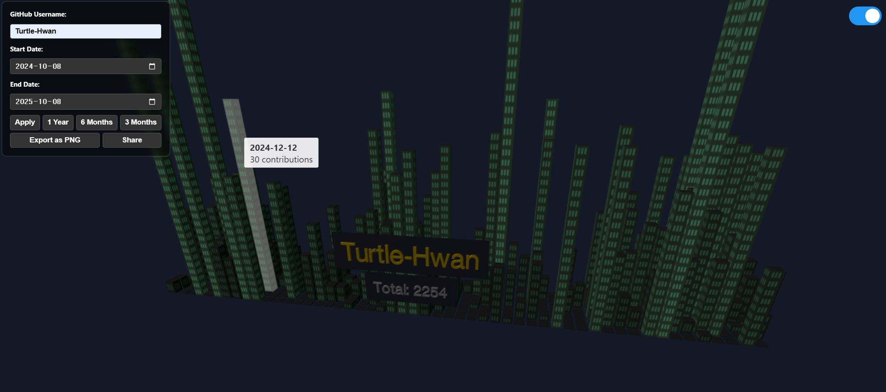

# Awesome GitHub 3D Contributions Grass 🏙️

Turn your GitHub contribution graph into a stunning 3D city! This project visualizes your coding activity as a dynamic, interactive 3D model.

---

## ✨ Live Demo

**[Click here to see it in action!](https://turtle-hwan.github.io/awesome-github-contributions-3D/)**

---

## 🚀 Features

- **3D Visualization:** See your GitHub contributions come to life as a 3D city.
- **Interactive Experience:** Orbit, pan, and zoom to explore your creation from all angles.
- **Customizable Time Range:** View your contributions over the last year, 6 months, 3 months, or a custom date range.
- **Dark & Light Modes:** Choose the theme that best suits your style. The theme is saved in the URL for sharing.
- **Hover for Details:** Hover over any building to see the exact date and contribution count.
- **Share Your City:** A dedicated "Share" button copies the unique URL of your 3D graph to your clipboard.
- **Export to PNG:** Save a snapshot of your 3D contribution graph as a PNG image.

---

## 🛠️ How to Use

1.  **Enter GitHub Username:** Type in any GitHub username you want to visualize.
2.  **Select Date Range:** Use the buttons (1 Year, 6 Months, 3 Months) or the date pickers to select a specific period.
3.  **Apply Changes:** Click the "Apply" button to generate the 3D city.
4.  **Explore:** Use your mouse to rotate, zoom, and move around the city.
5.  **Toggle Theme:** Use the switch in the top-right corner to toggle between dark and light modes.

---

## 🌐 Share Your 3D Grass

Proud of your contribution history? Share it!

Click the **Share** button to copy the URL. This URL includes your selected username, date range, and theme, allowing others to see your exact 3D graph.

---

## 💻 Technologies Used

- **[Three.js](https://threejs.org/):** For the 3D rendering and interactivity.
- **HTML, CSS, JavaScript:** The core web technologies.
- **[GitHub Contributions API](https://github.com/jogruber/github-contributions-api):** To fetch the contribution data.

---

## 📄 License

This project is licensed under the MIT License. See the [LICENSE](LICENSE.md) file for details.
